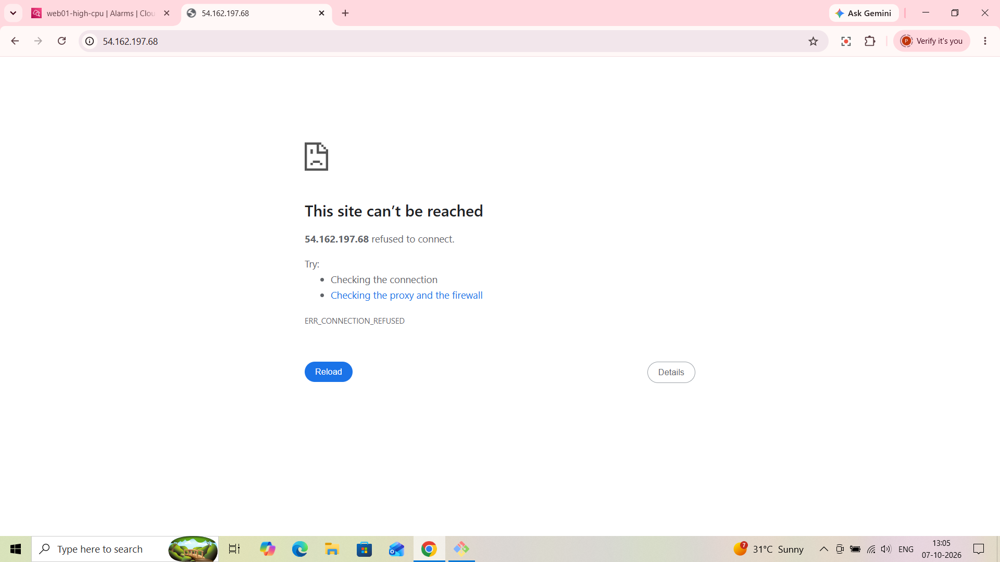
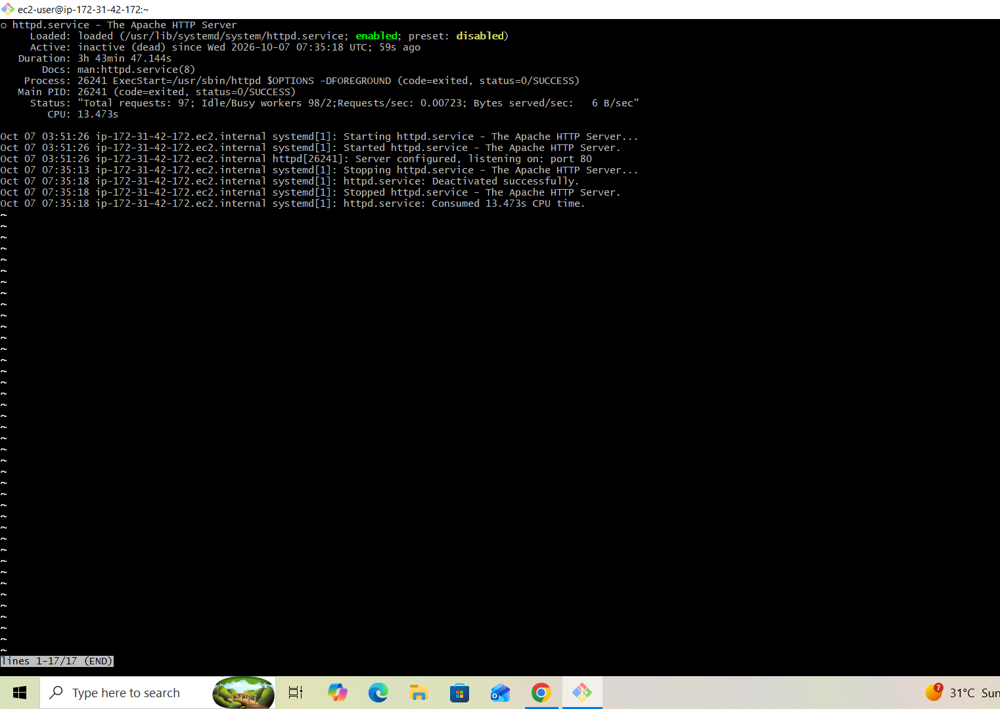
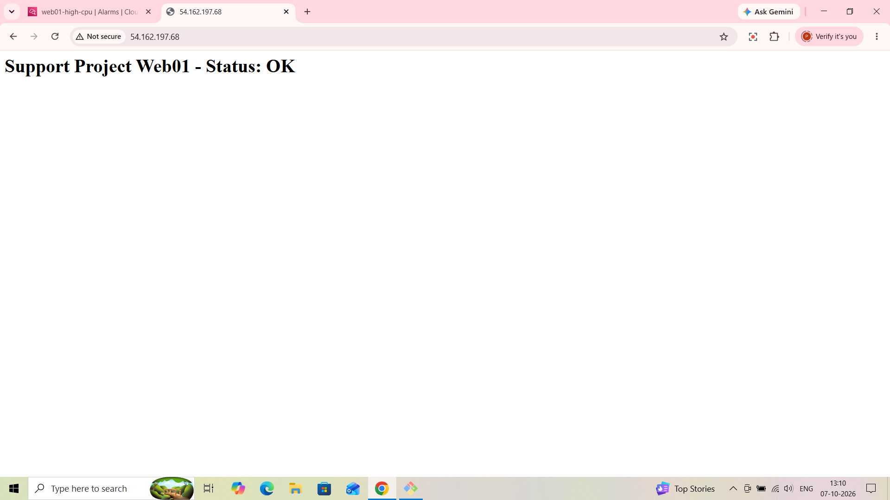

# AWS EC2 Incident Postmortem — Service Outage (Simulated)

**Author:** Piyush Awasthi
**Date:** 7 October 2026
**Environment:** AWS Free Tier — EC2 (Amazon Linux), Apache (httpd), CloudWatch
**Severity:** SEV-3 — single instance, lab environment, no customer impact
**Status:** Resolved

---

## 1. Summary

The Apache web service (`httpd`) on `web01` was intentionally stopped to simulate an application-level outage, distinct from the earlier resource-exhaustion (CPU spike) incident. The website became unreachable (`ERR_CONNECTION_REFUSED`) while the EC2 instance itself stayed healthy and reachable over SSH. The cause was confirmed with `systemctl status httpd`, and service was restored by restarting `httpd`, with the site confirmed working again about five minutes after the outage began.

---

## 2. Timeline

| Time (UTC) | Event |
|---|---|
| 03:51:26 | `httpd` started; service had been running continuously for ~3h 44m with no issues |
| 07:35:13 | Stop requested via `systemctl` (`Stopping httpd.service`) |
| 07:35:18 | `httpd` fully stopped (`Deactivated successfully`, exit status 0/SUCCESS) |
| ~07:35 (13:05 IST) | Browser check of `http://54.162.197.68` fails with `ERR_CONNECTION_REFUSED` |
| ~07:36 | `systemctl status httpd` confirms service is `inactive (dead)`, stopped 59 seconds earlier |
| Before 07:40 | `sudo systemctl start httpd` run to restore service |
| 07:40 (13:10 IST) | Browser check shows "Support Project Web01 - Status: OK" — service restored |

*IST times from the workstation clock were converted to UTC (IST = UTC+5:30) to match the server's logs.*

**Outage start — browser failing to connect:**

---

## 3. Detection

- **What alerted you?** A manual browser check. No automated alert fired for this incident.
- **Did the StatusCheckFailed alarm trigger?** It was not expected to. EC2 status checks test the instance and underlying host, not whether an application is serving traffic, and the instance remained fully reachable over SSH throughout. [CONFIRM: check CloudWatch and note here that `web01-status-check-failed` stayed in OK state during the outage.]
- **Time to detect:** Immediate in this exercise because the outage was deliberate. In a real scenario with only the existing alarms, nothing would have notified anyone — detection would have depended on a user reporting the site down. This is the key monitoring gap the incident exposed.

---

## 4. Investigation

- **Tools/commands used:**
  - Browser check of the public IP — confirmed user-facing impact
  - SSH into the instance — confirmed the server itself was up and reachable
  - `systemctl status httpd` — confirmed the state of the service and its recent log entries

- **Reading the browser error:** `ERR_CONNECTION_REFUSED` (as opposed to a timeout) means the instance was reachable on the network but nothing was listening on port 80. A timeout would have pointed toward a security group or network-filtering problem; a refusal pointed directly at the application layer.

- **What the service status showed:**
  - `Active: inactive (dead)` — Apache was not running
  - `Process: ... (code=exited, status=0/SUCCESS)` and `Deactivated successfully` in the logs — a clean, requested shutdown rather than a crash, out-of-memory kill, or failed start. A crash would typically show a `failed` state or a signal/error exit code instead.
  - `Loaded: ... enabled` — the service is configured to start on boot, so it would have recovered after a reboot, but not after a manual stop.
  - The log lines show the full lifecycle: started 03:51:26, then stopped at 07:35:18.

- **What was ruled out:** Network or security-group problems (connection was refused, not timed out), instance-level failure (SSH worked), and an application crash (clean exit status).

- **Root cause identified:** The `httpd` service was manually stopped with `systemctl`, simulating an accidental stop or a service terminated during maintenance or deployment.

---

## 5. Resolution

- **Action taken:** `sudo systemctl start httpd`
- **Verification:** Browser refresh showed the page loading correctly again (screenshot below, taken 13:10 IST / 07:40 UTC).
- **Time to resolve:** Roughly 5 minutes from the service stopping (07:35:18) to confirmed restoration (by 07:40). The exact restart time was not captured.

---

## 6. Impact

- **Who/what was affected:** The web service on a single lab instance. The instance itself, SSH access, and monitoring continued to work normally.
- **Duration of degraded state:** Approximately 5 minutes.
- **Traffic affected:** Negligible — the service log shows only 97 total requests served over its ~3h 44m uptime. In a production setting the same outage would have directly impacted users.

---

## 7. Prevention / Follow-up Actions

- [ ] Add application-level monitoring so an outage like this triggers an alert automatically — for example, a CloudWatch Synthetics canary or a scheduled health check against the site, or a free external uptime monitor pointed at the public IP. The existing EC2 alarms cannot detect this failure mode.
- [ ] Configure a systemd restart policy (`Restart=on-failure`) for `httpd` so it recovers automatically from crashes. Note that this would **not** have helped here — systemd treats a manual `systemctl stop` as intentional and does not restart the service — so this protects against a different failure mode.
- [ ] For deliberate stops (maintenance, deployments), rely on change communication and a post-change health check rather than automatic restarts.
- [ ] Add a CloudWatch alarm on the application health signal once it exists, routed to the same SNS topic as the CPU alarm so both incident types alert through one channel.

---

## 8. Lessons Learned

This incident showed that a healthy instance does not mean a healthy application. The EC2 status checks and CPU alarm would both have looked perfectly normal while the website was completely down, so infrastructure-level monitoring alone leaves a blind spot. It also showed how much a single error message tells you: `ERR_CONNECTION_REFUSED` and a clean exit status in `systemctl status` pointed to a stopped application within seconds, without needing to touch networking or security groups. Together with the CPU spike incident, this covers two different failure modes — resource exhaustion and service failure — and exposed a different monitoring gap in each.
